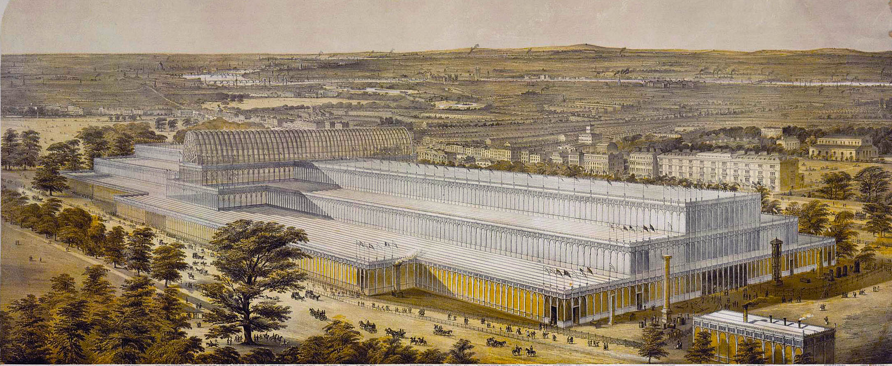
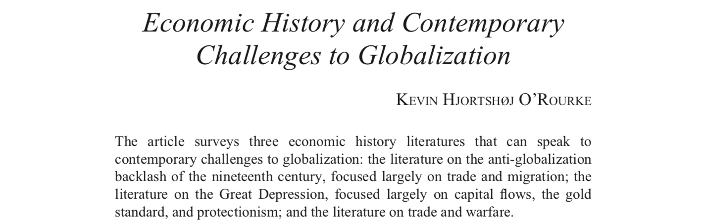
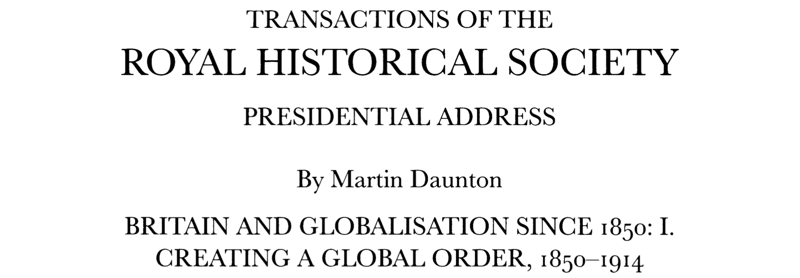
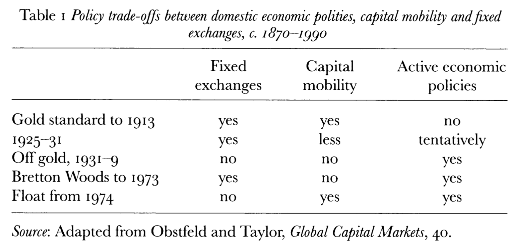

```{r setup, include=FALSE}
knitr::opts_chunk$set(echo = FALSE, warning = FALSE,
                      message = FALSE, fig.align='center', fig.retina=3,
                      out.width="75%")
```

```{r xaringan-themer, include = FALSE}
library(xaringanthemer)
style_solarized_light()
source("helper_functions/theme_lecture.R")
xaringanExtra::use_webcam()
xaringanExtra::use_tile_view()
```

## Today's Plan

.large[
+ Introductions
+ Course mechanics
+ Lecture
+ Discussion
]

---

class: inverse, center, middle

# **Introduction: About the course**

.Large.left[
+ Explaining the 'first era of globalization' (arguably)
    - A view from the center
]

--

.Large.left[
+ Thinking about drivers of economic integration and disintegration
    - at a time of global integration (trade in goods/services)
    - with substantial shocks and discontent (war, supply chains, financial crisis, trade wars, brexit, etc.)
]

---

class: inverse, center, middle

# Introductions

.left[
### **About me**

Name: **Gabriel Geisler Mesevage** (Call me Gabe/Gabriel; he/him) <br>
Field: **Economic and Financial History**

I'm really interested in understanding financial markets in history, how people understood investments, and how markets produced information for investors. I've worked on company promotion, white-collar crime, the financial press, links between politicians and companies, and rating agencies, all in the 19th century, mostly in the UK. I've also done some work on networks: how and when they are useful objects and how to work with network data, and recently I've been working on modelling poverty and mortality in 19th century Britain. I like making graphs.

**Contacting me**: Feel free to email
+ Office hours (in S8.22): Monday 1-2pm, Wednesday 12:30-1:30. 
]

### **About you...**

---

# Course Mechanics

## Assessment

.large[
+ 1 $\times$ 3,500 word essay **due 23 Apr 2024 - 16:00!!**
    - KCL is *unrelenting* about deadlines -- must be submitted by 15:59:59 on the day!
    - I have no power to grant extensions
    - If you need an extension write to your tutor about an MCF (mitigating circumstances form)
]

--

.large[
+ For the essay **you will come up with a question**
    - Come discuss your question with me
    - Must be related to course (obviously) but can be interpreted broadly
+ In weeks 6-10 we will set aside class time for each of you to discuss your essay question/approach and get feedback (not graded)
]

---

# Mechanics: Submitting assignments

.center[

]

---

# Mechanics: Readings

.Large[
[The Keats Page](https://keats.kcl.ac.uk/course/view.php?id=108530)

[Also on github](https://github.com/gabrielfgm/ma_econ_history)

**These should be the same, if they are not email me**
]

---

# Mechanics: Classroom discussion

### Approach to teaching

> "...the brain learns the thinking it practices, and little else." 
<br>&mdash;(Wieman 2019, 56)

+ Focus is on discussion not lecturing so it is the role of students to articulate the key ideas in the articles

--

### Weekly 'discussants'

+ Each week I will ask a few of you to volunteer to start the discussion by telling us what the readings are trying to do, and by suggesting some interesting questions for class discussion.
+ This contribution should be very brief (10-15 minutes of class time!) and shared between several people.

---

# Mechanics: expectations about content

.large[
+ The topic of this course falls squarely within 'economic history' 
+ Sub-field is split between departments (econ/history/geography/stand-alone departments)
+ Some of the articles we read look more like economics/political science (mathematical models, regression tables)
]

--

.large[
**My expectation is that you read quantitative work critically and try to understand the intuition.**

I do not expect you to master this content, although I will try to provide some guidance on how to read and interpret regression results.

**I do NOT expect the essays you submit to me to incorporate mathematical modelling or statistical analysis.** Although you can if you want to.
]

---

# Britain in 1850



---

## 1850 as an apogee?

.large[
+ Highest GDP/capita worldwide 
    - (we think)
    - (not highest wages!)
+ Military security
    - Period of 'Pax Britannica' post-Napolean pre-Crimea
+ Rising prosperity
]

## But

.large[
+ Social dislocation of industrial transformation
]
---

# More Industrial

```{r, comparative_industrialization, out.width='70%', fig.height=4, fig.width=6, fig.retina=4}
library(tidyverse)
library(ggrepel)
library(viridis)
library(ggalt)

eu_ind <- data.frame(date = rep(c(1750, 1800, 1860, 1913), 10),
                     country = rep(c("Austria-Hungary", "Belgium", "France", 
                                     "Germany", "Italy", "Russia", "Spain",
                                     "Sweden", "Switzerland", "United Kingdom"), each=4),
                     industry_index = c(7, 7, 11, 32, 9, 10, 28, 88, 
                                        9, 9, 20, 59, 8, 8, 15, 85,
                                        8, 8, 10, 26, 6, 6, 8, 20,
                                        7, 7, 11, 22, 7, 8, 15, 67,
                                        7, 10, 26, 87, 10, 16, 64, 115))


eu_ind %>%  
  ggplot(aes(date, industry_index, group=country, color=country)) +
  geom_line() +
  geom_point(size = 3) + 
  geom_text_repel(data = eu_ind %>% filter(date == 1913), 
                   aes(date, industry_index, label=country), 
                  nudge_x = 20, segment.colour = "black", segment.alpha = .5) +
  theme_minimal() +
  xlim(c(1750, 1950)) + 
  guides(color=FALSE) +
  scale_color_viridis_d(option = "plasma", direction = -1) +
  xlab("") + ylab("Industrialization Index") +
  ggtitle("British Industrialization in European Perspective",
          subtitle = "Source: Bairoch 1994.") +
  theme_lecture

```

---

# Less agricultural 

```{r, ag_share, out.width='70%', fig.height=4, fig.width=6, fig.retina=4}
library(ggalt)
ag_share <- tibble(year = c(1780, 1820, 1870, 1913),
                   ag_share = c(45, 35, 22.7, 11.8))

ag_share %>% 
  ggplot(aes(as.factor(year), ag_share, label = paste0(ag_share, "%"))) +
  geom_lollipop(point.colour = "coral", 
                point.size = 5, ) +
  geom_text(nudge_y = 3) +
  ylab("Percent of Workforce in Agriculture") +
  xlab("Date") +
  ggtitle("The Falling Share of Agricultural Employment in England, 1780-1913", 
          subtitle = "Source: Crafts 1998, pp. 195") +
  theme_minimal() +
  theme_lecture
  
```

---

```{r gdp_pc, out.width='80%', fig.height=4, fig.width=7, fig.retina=4}
library(tidyverse)
library(readxl)

real_gdp_eng <- read_xlsx(path = "~/Dropbox/teaching/beh-slides/data/a-millennium-of-macroeconomic-data-for-the-uk.xlsx", 
                      sheet = "A21. GDP per capita 1086+", 
                      range = "A5:K859")

names(real_gdp_eng)[1] <- "Year"

real_gdp_eng %>% 
  filter(Year > 1270) %>% 
  ggplot(aes(Year, `Real GDP per capita`)) +
  #geom_point() + 
  geom_line() +
  scale_x_continuous(breaks = seq(1300, 1900, 50)) +
  ggtitle("English Real GDP per capita, 1270-1939", 
          subtitle = "Source: Broadberry et. al. (2015) & Bank of England") +
  ylab("Real GDP per capita") + 
  tidyquant::theme_tq() +
  theme_lecture

```

---

```{r gdp_pc_ir, out.width='80%', fig.height=4, fig.width=7, fig.retina=4}

real_gdp_eng %>% 
  filter(Year > 1270) %>% 
  ggplot(aes(Year, `Real GDP per capita`)) +
  #geom_point() + 
  geom_line() +
  scale_x_continuous(breaks = seq(1300, 1900, 50)) +
  ggtitle("English Real GDP per capita, 1270-1939", 
          subtitle = "Source: Broadberry et. al. (2015) & Bank of England") +
  ylab("Real GDP per capita") + 
  annotate("rect", xmin=1850, xmax=1914, 
           ymin=800, ymax=6000, fill="coral",
           alpha=.3) +
  annotate("text", x=1670, y=5500, 
           label="What this course covers", color="coral") +
  tidyquant::theme_tq() +
  theme_lecture

```

---

```{r, comparative_perspective, out.width='80%', fig.height=4, fig.width=6, fig.retina=4}
library(ggrepel)

maddison <- read_xlsx(path = "~/Dropbox/teaching/beh-slides/data/mpd2018.xlsx", 
                      sheet = "Full data")

plotdf <- maddison %>% filter(year <= 1851, 
                    year > 1700, 
                    countrycode %in% c("GBR", "FRA", 
                                       "NLD", "AUT", 
                                       "DEU", "CHN",
                                       "IND", "JPN"),
                    !is.na(cgdppc))

plotdf %>% 
  ggplot(aes(year, cgdppc, 
             group = countrycode,
             color=countrycode)) +
  ggtitle("British GDP per capita in a global mirror", 
          subtitle = "Source: Maddison project") +
  geom_line() +
  geom_point() +
  geom_label_repel(data = plotdf %>%
              group_by(countrycode) %>% 
              filter(year == last(year)) %>% 
              ungroup(), 
            aes(label = country, x = year, y=cgdppc, color=countrycode),
            nudge_x = 15) +
  xlim(c(1700,1900)) +
  guides(color = FALSE) +
  scale_color_brewer(type = "qual", palette = 2) +
  tidyquant::theme_tq() +
  theme_lecture

```

---

```{r, climacteric, out.width='80%', fig.height=4, fig.width=6, fig.retina=4}

plotdf <- maddison %>% filter(year >= 1800, 
                    year <= 1940, 
                    countrycode %in% c("GBR", "FRA",
                                       "DEU", "USA"),
                    !is.na(cgdppc))

plotdf %>% 
  ggplot(aes(year, cgdppc, 
             group = countrycode,
             color=countrycode)) +
  ggtitle("British GDP per capita in a global mirror", 
          subtitle = "Source: Maddison project") +
  geom_line() +
  geom_point() +
  geom_label_repel(data = plotdf %>%
              group_by(countrycode) %>% 
              filter(year == last(year)) %>% 
              ungroup(), 
            aes(label = country, x = year, y=cgdppc, color=countrycode)) +
  guides(color = FALSE) +
  scale_color_brewer(type = "qual", palette = 2) +
  tidyquant::theme_tq() +
  theme_lecture

```

---

## The fear of relative decline

.large[
+ An enormous literature and contemporary commentary on why Germany/USA caught up
    - 'Climacteric' debate
    - Entrepreneurial failure debate
    - Export of capital/political economy of colonialism debate
]

---

### Globalization and Deglobalization in Historical Perspective

.center[

]
<br>
.center[

]

---

## The first economic globalization?

.large[
+ In quantitative terms first period of intense economic integration
  - Per some specific criteria
+ Unrestricted capital movement
+ Largely unrestricted population movements
+ Major liberalization of trade
    - Some direct political moves to free-trade (e.g. Corn Laws)
    - Some a product of technological change (improved transport, refrigerated shipping, etc.)
    
+ Political consequences of economic integration?
]

---

## Globalization and politics


### Why did Globalization collapse?

.large[ 
+ 3 hypotheses (James, *The End of Globalization*, 2001)
    - Speculative finance
    - Nationalist resentment of distributional consequences (pressure on wages, sectors)
    - Growth of national structures to cope with global forces

> "The history of the modern world economy illustrates two points. First, economies work best when they are open to the world. Second, open economies work best when their governments address the sources of dissatisfaction with global capitalism." (Frieden, *Global Capitalism*, p. 476)
]

---

## Globalization and politics

### The distributional consequences of integration

+ The Trilemma
    + The 'inconsistent quartet' with trade 
    + Expanded to 'incompatible quintet' with migration/labor market 

.center[

]

---

## The consequences of economic globalization?

### A cause of the Great Depression?

> "To the extent that the Depression was caused by malfunctioning international capital markets, or the gold standard that was thought at the time to underpin them, we have yet another case of globalization undermining itself, since the Depression was the major cause of interwar protectionism" (O'Rourke 2019, 371-2).

### A cause of WWI?

> "...capital flows and technology transfer helped Russia converge on the established powers. This disrupted pre-existing geopolitical equilibria and led Germany in particular to devise military strategies to counter the threat. ...the spread of the Industrial Revolution to Germany had earlier undermined the geopolitical equilibrium in Europe.." (O'Rourke 2019, 373).

---

class: center, inverse, middle

# Quick review of syllabus

---

class: center, inverse, middle

# Discussion

> Is something not covered that you hoped to cover?

--

<br>

> Is the late-19th century the first era of globalization?

--

<br>

> What do we mean by the term 'globalization' anyway?
